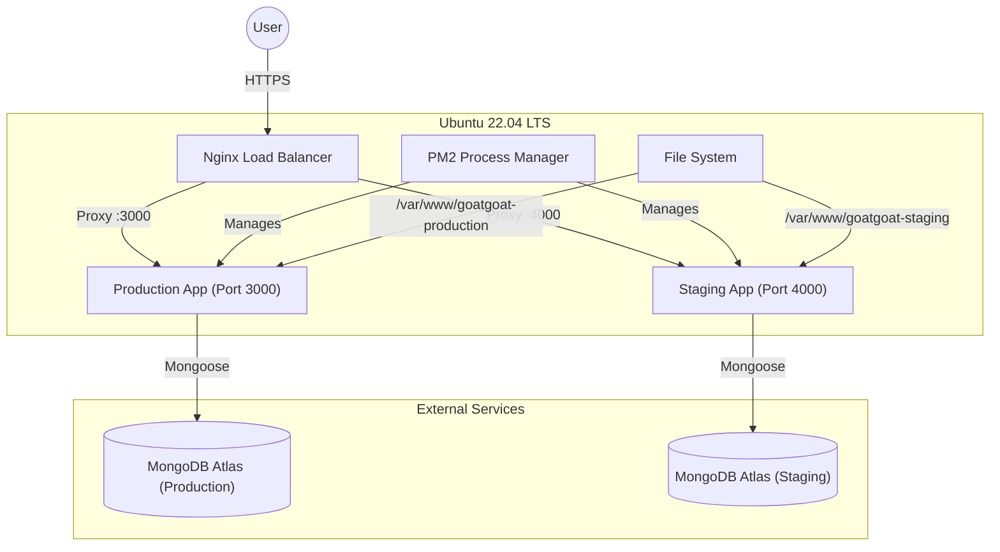

# Server Analysis Report

## 1. Server Overview
- **Hostname:** `srv1007003`
- **IP Address:** `147.93.108.121`
- **Operating System:** Ubuntu 22.04.5 LTS (Jammy Jellyfish)
- **User:** `root`
- **Node.js Version:** v20.19.5
- **NPM Version:** 10.8.2
- **Disk Usage:** 39% Used (19GB used / 30GB available)
- **Memory Usage:** ~41% (Baseline)

## 2. Process Management (PM2)
The server uses PM2 to manage Node.js applications in a clustered environment.

| ID | Name | Port | Env | Path | DB |
| :--- | :--- | :--- | :--- | :--- | :--- |
| 0 | `goatgoat-production` | 3000 | Production | `/var/www/goatgoat-production/server` | `GoatgoatProduction` |
| 2 | `goatgoat-staging` | 4000 | Staging | `/var/www/goatgoat-staging/server` | `GoatgoatStaging` |

- **PM2 Config:** `/root/ecosystem.config.js` (and `/var/www/*/server/ecosystem.config.cjs`)
    - `goatgoat-app-backup-*/`: Versioned application backups.

## 5. ⚠️ Critical Development Rules & Current State
> [!IMPORTANT]
> **SRC=DIST Rule**: NEVER edit the `dist/` directory directly. Always make changes in `src/` and run `npm run build`.

> [!WARNING]
> **AdminJS Fragility**: The AdminJS configuration in `dist/config/setup.js` is critical. Changes to the admin panel must be tested thoroughly in staging first.

> [!CAUTION]
> **Git Drift Detected**: The production server has uncommitted changes, including modifications to `dist/` files and untracked files like `src/routes/sellerNotifications.js`. **`git pull` will fail** until this is resolved.

## 6. Architecture Diagram

## 7. Upgrade & Deployment Workflow
Based on the existing infrastructure, the recommended upgrade path is:

1.  **Development**: Make code changes in `src/` locally.
2.  **Push**: Push changes to the git repository.
3.  **Staging Deployment**:
    - Pull code to `/var/www/goatgoat-staging/server`.
    - Run `npm install` and `npm run build`.
    - Restart staging: `pm2 restart goatgoat-staging`.
    - **Verify** changes on `staging.goatgoat.tech` (or port 4000).
4.  **Production Deployment**:
    - **Backup**: Run the backup script or create a manual snapshot.
    - Pull code to `/var/www/goatgoat-production/server`.
    - Run `npm install` and `npm run build`.
    - Restart production: `pm2 restart goatgoat-production`.
    - Monitor logs: `pm2 logs goatgoat-production`.

## 8. AdminJS & FCM
- **AdminJS**: Hierarchical structure (User, Seller, Store, Product, Order, System).
- **FCM**: Integrated for push notifications. Service account keys are in `secure/firebase-service-account.json`.
